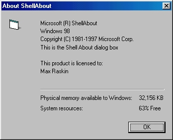



## Shell About

### Description

Show up the Windows's Shell About (Help>About explorer) with your own application information and icon
 
### More Info
 

             |
---                |---
**Submitted On**   |2000-02-18 18:10:28
**By**             |[Max Raskin](https://github.com/Planet-Source-Code/PSCIndex/blob/master/ByAuthor/max-raskin.md)
**Level**          |Intermediate
**User Rating**    |4.3 (13 globes from 3 users)
**Compatibility**  |VB 5\.0, VB 6\.0
**Category**       |[Windows API Call/ Explanation](https://github.com/Planet-Source-Code/PSCIndex/blob/master/ByCategory/windows-api-call-explanation__1-39.md)
**World**          |[Visual Basic](https://github.com/Planet-Source-Code/PSCIndex/blob/master/ByWorld/visual-basic.md)
**Archive File**   |[CODE\_UPLOAD34602182000\.zip](https://github.com/Planet-Source-Code/max-raskin-shell-about__1-6124/archive/master.zip)

